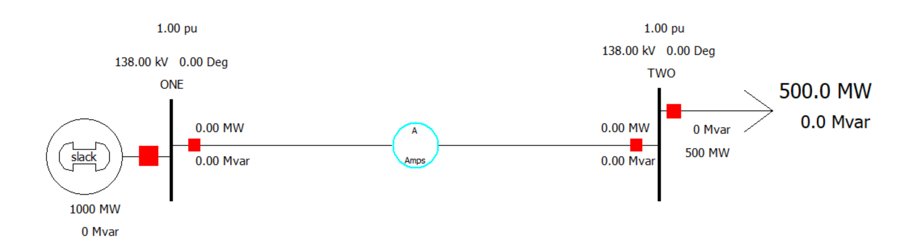
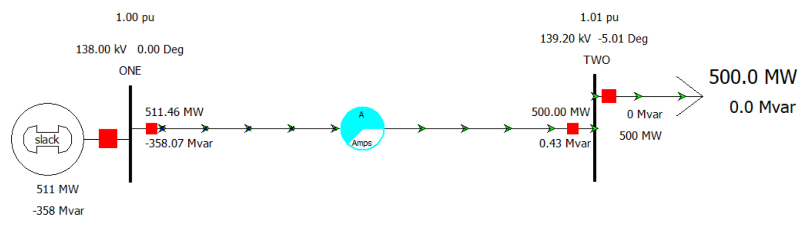
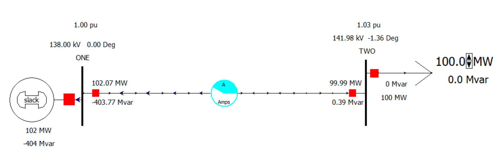
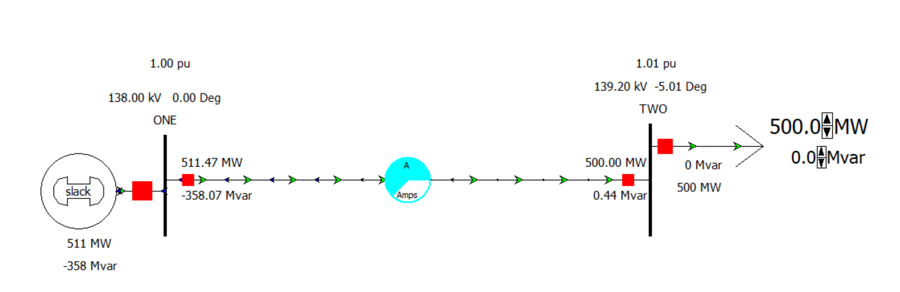
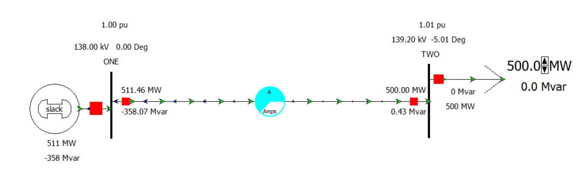

# Two-Bus Transmission Line Power Flow Analysis

## Overview
This project analyzes real and reactive power flow in a two-bus transmission system using PowerWorld Simulator.

The study investigates how changing load in MW and MVAR affects:
- bus voltage magnitude
- bus voltage angle
- real power flow
- reactive power flow
- transmission line loading

## Aim
To study real power and reactive power flow in a one-line diagram of a two-bus system and observe how voltage magnitudes, bus angles, and power-flow direction change with MW and MVAR loading.

## System Description
The system consists of:
- **Bus 1**: slack bus / generator bus
- **Bus 2**: load bus
- one transmission line connecting both buses

## System Parameters
- Nominal voltage at Bus 1 and Bus 2: **138 kV**
- Generator rating: **1000 MW**
- Base power: **500 MVA**
- Load rating used in the base case: **500 MW**
- Transmission line parameters:
  - Resistance, **R = 0.02**
  - Reactance, **X = 0.08**
  - Shunt charging capacitance, **B = 0.8**

## Software Used
- PowerWorld Simulator

## Simulation Screenshots

### Two-Bus System Model

**Graph result:** This figure shows the one-line two-bus transmission system used for the power-flow analysis.

### Power Flow at 500 MW

**Graph result:** At 500 MW load, real power flows from Bus 1 to Bus 2 and the line operates within normal loading range.

### MW Variation View

**Graph result:** As MW load increases, line loading increases and the receiving-end voltage at Bus 2 decreases gradually.

### MVAR Variation View

**Graph result:** As reactive power demand increases, Bus 2 voltage drops further, showing the effect of reactive loading on voltage regulation.

### Direction of Real and Reactive Power Flow

**Graph result:** The direction of reactive power flow changes when the Bus 2 voltage becomes lower than the Bus 1 voltage.

## Key Results

### 1) No-load condition
At **0 MW and 0 MVAR**, the voltage at **Bus 2** is higher than the voltage at **Bus 1**. This is the **Ferranti effect**, which occurs because of the inductance and capacitance of the transmission line.

### 2) Effect of increasing MW load
When load is increased from **0 MW to 1000 MW** while keeping reactive load at **0 MVAR**:
- real power flow increases
- Bus 2 voltage decreases
- reactive power flow decreases
- Bus 2 per-unit voltage changes from about **1.03 p.u to 0.98 p.u**

### 3) Effect of increasing MVAR load
When reactive load is increased from **0 MVAR to 500 MVAR** while keeping real power at **500 MW**:
- Bus 2 voltage decreases further
- Bus 2 per-unit voltage changes from about **1.01 p.u to 0.92 p.u**
- reactive power demand increases significantly

### 4) Reactive power flow direction change
At about **300 MVAR**, corresponding to:
- **131.98 kV**
- **-4.52 degrees**
- about **0.95 p.u**

the direction of reactive power flow changes because the receiving-end voltage becomes lower than the sending-end voltage.

## Transmission Line Loading Results

| Load (MW) | Bus 2 Voltage (kV) | Bus Angle at Bus 2 (deg) | Line Loading |
|---|---:|---:|---:|
| 750 | 137.08 | -7.40 | 83% |
| 800 | 136.62 | -7.89 | 88% |
| 850 | 136.14 | -8.38 | 92% |
| 900 | 135.64 | -8.88 | 97% |
| 950 | 135.13 | -9.39 | 102% |
| 1000 | 134.61 | -9.90 | 107% |

**Observation:** the line becomes overloaded above about **950 MW**.

## Important Discussion
- Real power flow mainly depends on the **voltage angle difference** between buses.
- Reactive power flow mainly depends on the **difference in voltage magnitude** between buses.
- At low or no load, the Ferranti effect causes the receiving-end voltage to rise.
- At higher MW loading, line loading increases and Bus 2 voltage decreases.
- At higher MVAR loading, the voltage drop becomes stronger and reactive power-flow direction can reverse.

## Conclusion
This project demonstrates the behavior of real and reactive power flow in a two-bus transmission line using PowerWorld Simulator. Increasing MW load mainly increases real power transfer and line loading, while increasing MVAR load causes a stronger voltage drop at Bus 2. The analysis also shows the Ferranti effect at no load and overload conditions at high MW loading.

## Repository Contents
- `README.md` – project documentation
- `Figures/` – simulation screenshots
- `FINAL PSA REPORT.docx` or project report file – detailed lab report
- Power Electronics
